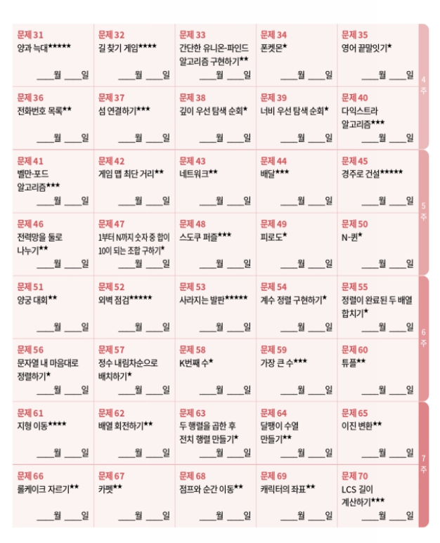
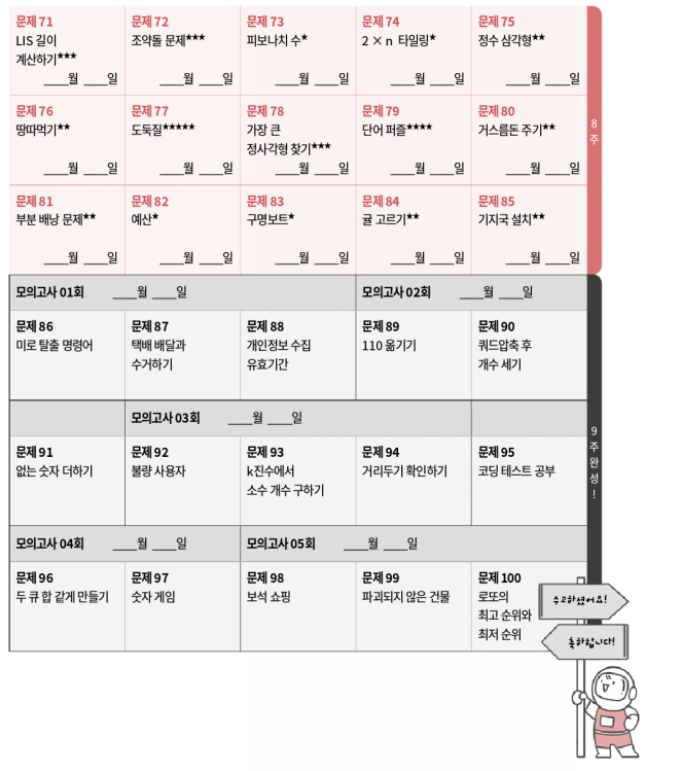

# 📚 Coding Test Study

프론트엔드 코딩 테스트 합격을 목표로 진행하는 알고리즘 스터디입니다.  
문제 풀이를 넘어 **사고 과정 공유와 기술 면접 대비**까지 함께 준비합니다.

<br/>

## 📌 스터디 소개

- 매주 특정 **자료구조 / 알고리즘 주제**를 선정합니다.
- 해당 주제 관련 문제 **6~7문제**를 풀어옵니다.
- 오프라인에서 풀이 과정 및 접근 방법을 공유합니다.
- 각 문제는 **1명 이상 수도코드 기반 풀이 발표**를 진행합니다.
- 시간이 남는 경우, 해당 주차 주제에 대한 **모의 기술 면접**을 진행합니다.

<br/>


## 👥 스터디 멤버

| 이름 | 참여 횟수 | 참여 배지 |
|------|-----------|-----------|
| 강병국 | 1 / 12 | 🏅 |
| 김문기 | 1 / 12 | 🏅 |
| 박설화 | 1 / 12 | 🏅 |
| 신태일 | 1 / 12 | 🏅 |

<br/>

---

## 📅 스터디 일정

- 기간: **2026.02.13 ~ 2026.05.01** (총 12회, 3개월)
- 시간: 매주 금요일 오후 7시 (최대 120분)

| 회차 | 날짜 | 기록 | 참여자 |
|------|------|------|--------|
| 1 | 26-02-13 (FRI) 19:00 | [1주차 - Array & Hash](https://github.com/iberis2/coding_test_study/blob/main/week_1/README.md) | 병국, 문기, 선우, 태일, 설화 |
| 2 | 26-02-20 (FRI) 19:00 | [2주차 - Stack & 구현(시뮬레이션) & 정렬](https://github.com/iberis2/coding_test_study/blob/main/week_2/README.md) | |
| 3 | 26-02-27 (FRI) 19:00 | [3주차]() | |
| 4 | 26-03-06 (FRI) 19:00 | [4주차]() | |
| 5 | 26-03-13 (FRI) 19:00 | [5주차]() | |
| 6 | 26-03-20 (FRI) 19:00 | [6주차]() | |
| 7 | 26-03-27 (FRI) 19:00 | [7주차]() | |
| 8 | 26-04-03 (FRI) 19:00 | [8주차]() | |
| 9 | 26-04-10 (FRI) 19:00 | [9주차]() | |
| 10 | 26-04-17 (FRI) 19:00 | [10주차]() | |
| 11 | 26-04-24 (FRI) 19:00 | [11주차]() | |
| 12 | 26-05-01 (FRI) 19:00 | [12주차]() | |


<br/>

---

## 🚀 스터디 진행 방식

### 0️⃣ 문제 선정 방식

- 매주 공통 문제 약 6문제 선정
- 차주 스터디 문제는 **스터디 당일 자정 이전까지 선정 후 채팅방 공지**
- 문제 선정 기준:
  - 프로그래머스 알고리즘 책 가이드
  - 고득점 Kit
  - 랜덤 문제 선정


### 1️⃣ 문제 풀이

- 해당 주차의 필수 문제 6~7문제를 사전에 풀이합니다.
- 풀이 코드는 해당 주차 디렉토리에 업로드합니다.
    - 사용 언어는 자유 (JavaScript, Python 등)
    - 모든 문제에 대해 최소 1개 이상의 풀이 코드 업로드
    - 다양한 방식으로 풀었다면 여러 버전 업로드 가능
    - 풀이하지 못한 경우, 접근 방식 및 수도코드를 업로드
- 스터디 시작 1시간 전까지 PR 제출 

---

### 2️⃣ 발표

- 자발적 발표자를 우선 선정합니다.
- 모든 문제는 최소 1명 이상 발표합니다.
- 발표자가 없는 경우 랜덤 선정합니다.
- 질의응답 및 접근 방식 토론을 자유롭게 진행합니다.
- 스터디 종료 전 당일 진행에 대한 피드백을 공유합니다.

---

### 3️⃣ 예치금 제도

- 스터디 시작 시 **예치금 1만원 입금**

#### 🔹 패널티 규칙
- 지각 2회 → 2,500원 차감
- 결석 1회 → 2,500원 차감

#### 🔹 슈퍼패스 제도
- 월 1회 사용 가능
- 사유 제출 필요 없음
- 스터디 **D-2일 전까지 톡방에 공유**

#### 🔹 환급 규칙
- 완주 시, 차감 금액 제외 후 환급
- 누적 패널티 금액은
  - 회의실 예약비
  - 스터디원 음료비
  등에 사용
- 카카오 모임통장으로 사용 내역 공유


## 📁 디렉토리 & 커밋 컨벤션

### 📂 디렉토리 구조

```

/{N}주차/{이름}/{문제명}.js

```

예시: `/1주차/박설화/두_개_뽑아서_더하기.js`


---

### 📝 커밋 메시지 규칙

- 자유 형식
- 예시:
```

feat: 두 개 뽑아서 더하기 O(n) 풀이
fix: 스택 풀이 예외 케이스 수정
refactor: 시간 복잡도 개선

```

<br/>

---

## 📃 주차별 주제

| 주차 | 주제 |
|------|------|
| 1주차 | Array, Hash |
| 2주차 | Stack |
| 3주차 | 예정 |
| 4주차 | 예정 |
| 5주차 | 예정 |
| 6주차 | 예정 |
| 7주차 | 예정 |
| 8주차 | 예정 |
| 9주차 | 예정 |
| 10주차 | 예정 |
| 11주차 | 예정 |
| 12주차 | 예정 |

---

## 🧭 참고 커리큘럼





